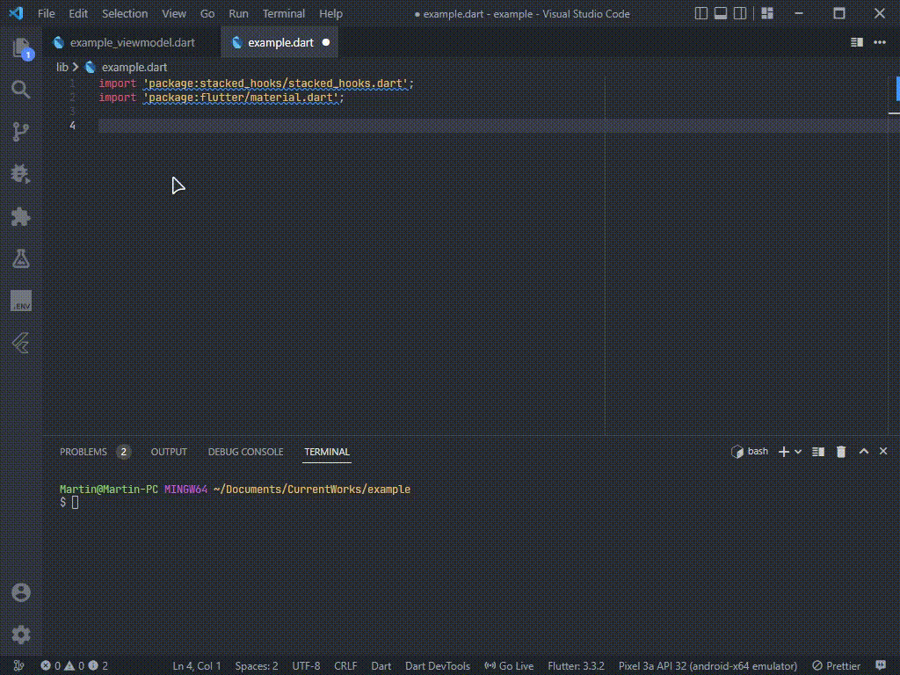

# README

A set of helpful Flutter and Dart snippets for day to day Flutter development.

## Features

Simply Flutter set of snippets for sacked arquitecture

I'm working hard to select all the day to day widgets, so wait for more!.

### Snippets

### Stacked Arquitecture related snippets

| Snippet    | Description                                                                       |
| ---------- | --------------------------------------------------------------------------------- |
| `hookW`    | Creates a Hook ViewModel Widget from stacked_hooks package with a given viewModel |
| `sService` | Creates a Service with lazySingleton annotation from injectable package           |
| `cDataS`   | Creates a DataSource from the ChopperApi with a basic structure                   |

### Flutter related snippets

| Snippet | Description                            |
| ------- | -------------------------------------- |
| `sbh`   | Create a Sized Box with a given height |
| `sbw`   | Create a Sized Box with a given width  |
